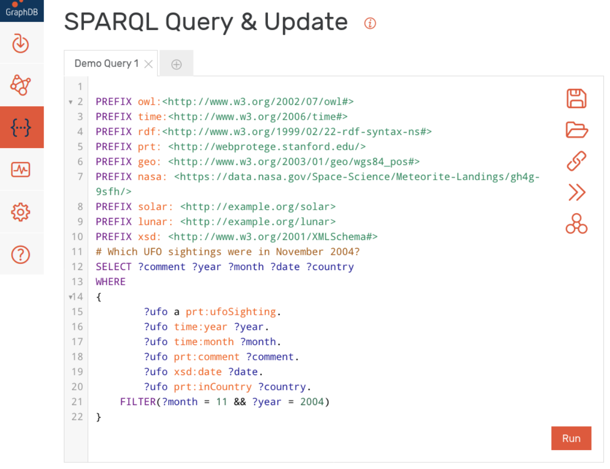
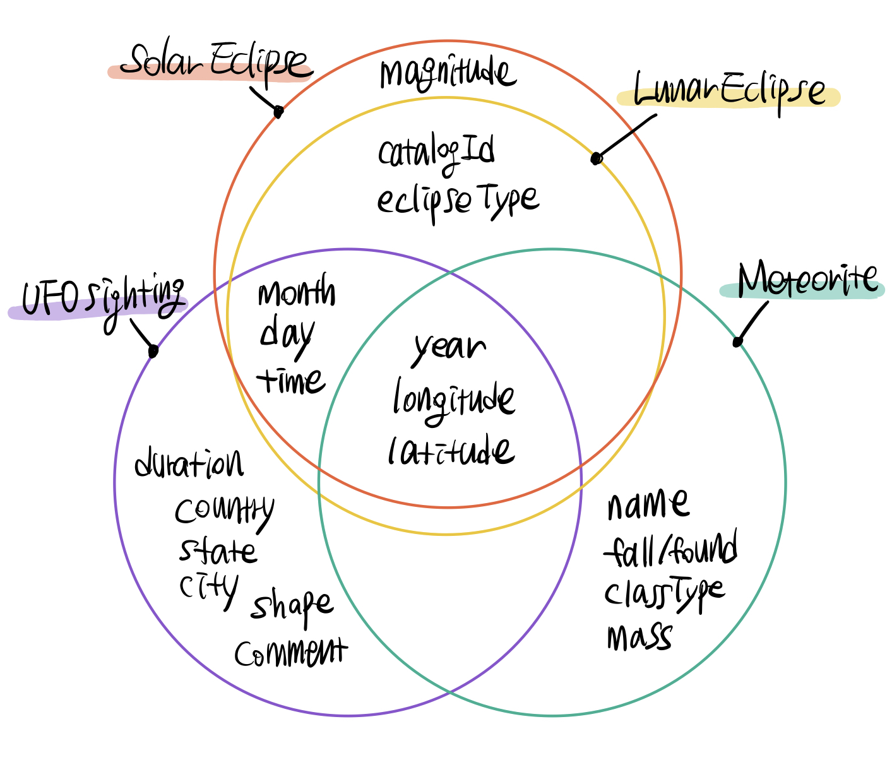

# Semantic Data Project
### Semantic Data Generation and Retrieval on UFO :alien: and Sky Events :stars: data  
As part of CECS 571. Fundamentals of Semantic Web Technology

## Project3. Semantic Data Retrieval

### How to Run Queries on UFO/SkyEvent semantic data
#### 1. Get RDF files of our semantic data
- Download and unzip [ufo-skyevent-rdf.zip](ufo-skyevent-rdf.zip)
- 4 rdf files included: ufo, solar, lunar, and meteorite
#### 2. Get GraphDB ready
- Install GraphDB  
    Visit [Ontotext GraphDB](https://www.ontotext.com/products/graphdb/graphdb-free/) to request a downloadable copy of GraphDB
- Follow their instructions to create a repository
- Import the downloaded RDF files into GraphDB  
    Import as "the default graph"
#### 3. Query
- Get [our sparql queries](sparql_queries/ "directory with sparql queries")
- Run a query from the query text files

## Project2. Semantic Data Generation
Converted `csv` files to `rdf` using [Jena API](https://jena.apache.org/).

- [Project2 requirements](docs/Project2.pdf)
- Original data are from:
    - [UFO Sightings in US](https://www.kaggle.com/NUFORC/ufo-sightings#complete.csv "Kaggle: UFO Sightings in US")
    - [Solar and Lunar Eclipses](https://www.kaggle.com/nasa/solar-eclipses "Kaggle: Solar and Lunar Eclipses") Date, time, and location of every eclipse in five thousand years
    - [Meteorite Landings](https://www.kaggle.com/nasa/meteorite-landings "Kaggle: Meteorite Landings") by NASA. 45k meteorites
- [the 'ontology generator' java project](ontologygenerator/)
- Converted rdf files are [here](ontologygenerator/rdf/ "directory with rdf files")
- dataset venn diagram
  
